# Assignment 0 Instructions:  Box Class

> **Late Days:** I am using 0 late days

The main purpose of this assignment is to make sure that your programming 
environment is set up correctly.  Assignment 0 demonstrates how each of future 
programming assignments will be structured and how the catch unit testing 
works.

***Be sure to read all instructions carefully before starting.***

This assignment is based around a Box class that stores a width, length, and 
height of a box and is able to perform several calculations using these 
dimensions.

## Deliverables

Typically, you will have a table of deliverables that you will need to 
complete for each project.  This table will also have a point breakdown for 
the project.

| Deliverable          | Points |
| -------------------- | ------:|
| Constructor_Test     |  3     |
| Getters_Setters_Test |  4     |
| Volume_Area_Test     |  2     |
| Commits              |  1     |
| Commenting           |  1     |
| Answer to Questions  |  10     |
| **Total**            | **21** |

## Questions (10 points)

Many of the assignments you get will require you to also provide written
answers by modifying the README file. To modify the README, you can click the
"Show Editor Preview" or "Editor" button in the upper right corner:

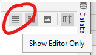

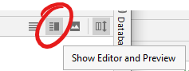

> **HINT:** Most of these answers to the questions are in this readme.  Be 
> sure to look out for hint boxes like these in the assignments.  It usually means, there is 
> something important to consider.  

1. Consider the following code snippet from the Box class.
    ```c++
    void Box::setWidth(double width) {
        if (width < 0)
            throw "Negative Dimension";
    
        width = width;
    }
    ```
    What is wrong with the following code snippet and why is it wrong? (1 
   points)
   
   > Your answer here. 
    
    List two different ways you could fix the code snippet. (2 points)
   
   > * Your answer here.
   > * Your answer here.

2.  What would you need to do in order to fix the "undefined reference" error 
    reported by the compiler? (1 points)
    
    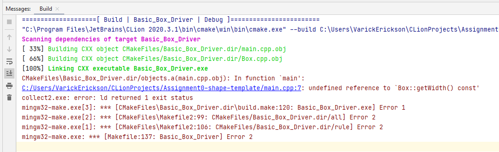
    
   > Your answer here.

3.  Suppose I had the following `CMakeList.txt`.
    
    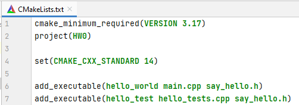

    What executables would I find in the run configuration dropdown menu? (2 
    points) 

   > Your answer here.

4.  Will the Catch2 tests run if you haven't implemented `Box.cpp`? (1 point)

   > Your answer here.

5.  Should you add all the unversioned files when committing? (1 point)
    
   > Your answer here.

6.  How often should you commit your assignment? (1 point)

   > Your answer here

7.  If you commit without pushing, will it still send the changes to the 
    online github repository? (1 point)
    
   > Your answer here

8.  How often should you push your repository? (1 point)

   > Your answer here

# Getting Started

If you are viewing this README, then you have successfully downloaded CLion 
and managed to clone the project.  If you have not completed this step, 
please refer to the instructions posted on Blackboard.


## Box Functions

The following are the functions you will be implementing along with how they
should behave.  These functions will need to be implemented before the unit 
tests will work (see the sections on Catch2).

### `Box()`

The default constructor should initialize the width, height, and length to 0.

### `Box(int width, int height, int length)`

This constructor should set the width, height, and length of the object.  It
should throw "Negative Dimension" if a negative value is used for width,
height, or length.

### `getWidth() const`

This should return the width.

### `getHeight() const`

This should return the height.

### `getLength() const`

This should return the length.

### `setWidth(double width)`

This should set the width of the box.  It should throw "Negative Dimension"
if a negative value is used.

### `setHeight(double height)`

This should set the height of the box.  It should throw "Negative Dimension"
if a negative value is used.

### `void setLength(double length)`

This should set the length of the box.  It should throw "Negative Dimension"
if a negative value is used.

### `double getSurfaceArea() const`

This should return the surface area of the box.

### `double getVolume() const`

This should return the volume of the box.

### `void resize(double factor)`

This function should resize the width, height, and length of the box using
`factor`.


## Run Configurations

Each programming project will have multiple ways to run the project. You 
will have different run configurations depending on the program being run.

For this program, you will have 3 different run configurations:

| Run Configuration        | Description   |
| ------------------------ | --------------|
| `Basic_Test_Driver`      | Contains a main file that can be used for basic testing|
| `Constructor_Tests`      | Catch2 unit tests to verify that the constructors work |
| `Volume_Area_Tests`      | Catch2 unit tests to verify that the volume and area functions work |
| `Getters_Setters_Tests`  | Catch2 unit tests to verify getters, setters, resize work |

To run a specific configuration, you use the dropdown menu in the upper
right menu.

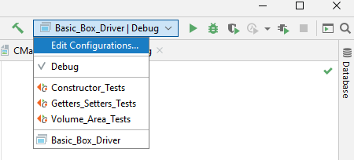

Notice that a different symbol is next to each run configuration. The  icon means that particular run configuration is a 
Catch2 executable.  The  icon means it is a 
standard C++ executable.

### CMake

So how did CLion create these run configurations?  This was done using a tool 
called CMake.

> "In software development, CMake is cross-platform free and open-source 
> software for build automation, testing and packaging using a 
> compiler-independent method. CMake is not a build system but rather it's a 
> build-system generator. It supports directory hierarchies and applications 
> that depend on multiple libraries."
> 
> - https://en.wikipedia.org/wiki/CMake

To define an executable, we use the "CMakeLists.txt" file.  This file 
contains instructions telling CMake how to create executables and what files 
are used to make the executables.  CLion reads this file and creates a 
dropdown of all the different executables that are available.

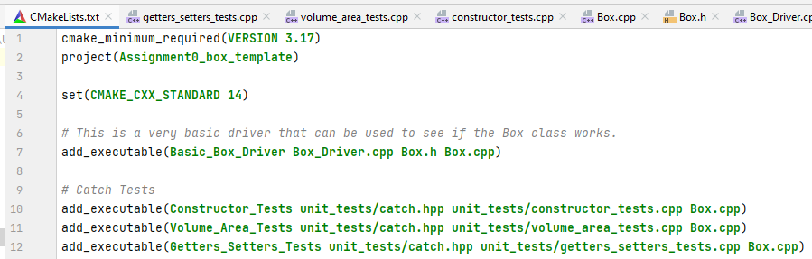


## `Basic_Test_Driver`
For most of your assignments, you will provided some sort of basic "driver". 
A driver is a program that can be used to do some basic testing while 
developing the program.  The provided driver you may modify however you wish 
during the development phase of the program.

To see the files used to create the `Basic_Test_Driver`, you can check the 
`CMakeList.txt` file.

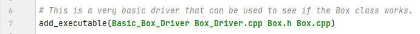

Here we see that `Basic_Test_Driver` uses `Box_Driver.cpp`, `Box.h`, and 
`Box.cpp` files.

To run the `Basic_Test_Driver` run configuration, select it from the 
dropdown menu and click the green play button.

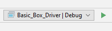

## Catch2

In the dropdown menu, you will notice that the tests have a slightly 
different icon associated with the run configuration.


There are hundreds of different tools available testing programs. For this 
class, we will be using the popular tool Catch2.  The first version of this 
tool was called Catch and they are working on the latest beta version called 
Catch3 (catchy names for sure).

> “Catch2 is a multi-paradigm test framework for C++. which also supports 
> Objective-C (and maybe C). It is primarily distributed as a single header 
> file, although certain extensions may require additional headers.”
> -	https://github.com/catchorg/Catch2/

One reason for its popularity is that it is a single file testing framework. 
In other words, all you need to do is place the catch.hpp file into your 
project folder in order to have a C++ testing framework available.
Phil Nash, one of the main authors of Catch2 goes into detail why he created 
the tool and provides a easy to follow demos of the tool features.  The link 
provided starts at the first demo portion:

> * https://youtu.be/Ob5_XZrFQH0?t=365  
> You only need to watch from 6:05-11:35

You are not required to watch the entire video, but it does contain quite a 
bit of interesting information about the tool philosophy and features.

For this class, we will provide testing files for you most of the time.
We will only very occasionally require you to add your own Catch2 tests for 
assignments.

## Running a Catch Test

To run the catch test, select the test from the dropdown menu and click the 
green play button.

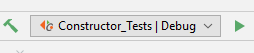

> **NOTE:** The catch tests will only run if you finish coding the `Box.cpp`.

If the test is successful, then you should see all the test with green 
checkmarks:

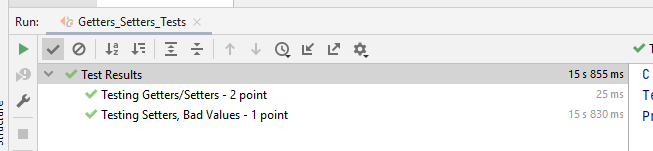

If the test does not run properly, then you will see an x:

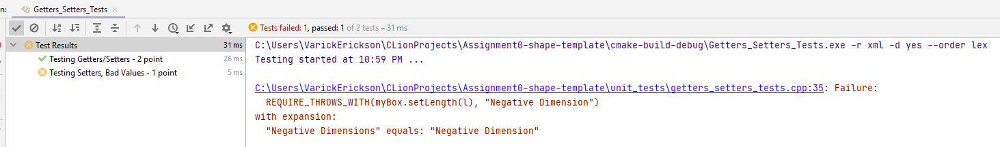

You can also see what went wrong.  Here the test is telling us that program 
threw the error "Negative Dimensions" instead of "Negative Dimension".

# Committing and Pushing

When you perform a "commit", you are saving saving all the changes to the 
file up to that point.  This save is local only.  In order for the commit to 
be reflected in your github repository, you need to perform a "push" command.
This will send all of the changes you committed on your local machine and 
send these changes to the online github repository.

Typically, you should commit any time you finish a function or complete some 
portion of the code.  Think of it like a save state for a video game.  In 
some instances, you may want to go back to an older save state.  Your 
commits should also have a short statement stating what was changed.  A 
short sentence is usually enough.  

Generally, you should push at least once every day.  Pushing after each
coding session for this class would also not be a bad idea.

## Commit Push - Good Example
Here is an example where I modified many files and want to commit these 
changes. It is usually a good idea to commit files together in logical groups.

For example, I could start by selecting the images that I modified and 
adding a short comment about the changes made.

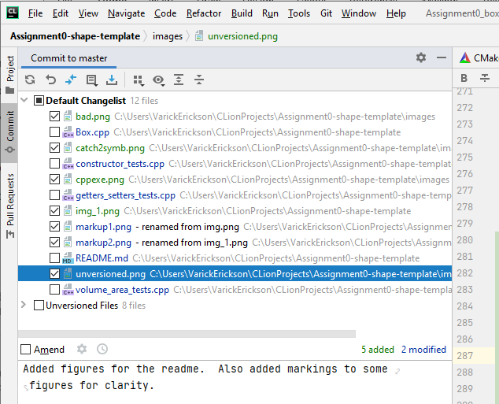

After clicking the "Commit" button, the changes for the selected image files 
are saved.

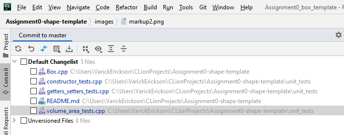

Notice we still have some files that have been changed that need to be 
committed.  I could next commit the tests.

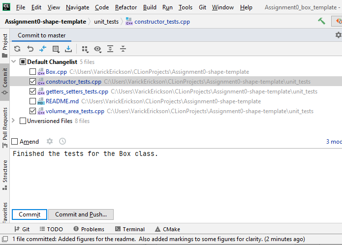

Lastly, I could commit the changes made to the `Box.cpp` and `README.md` files.

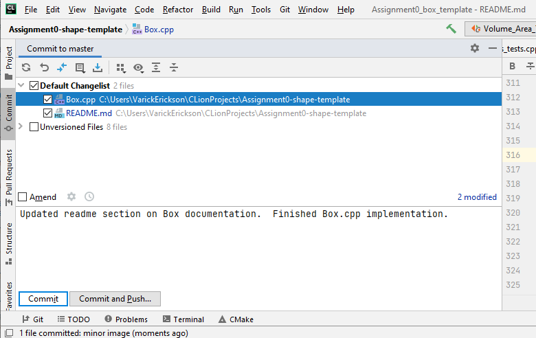

Once all the comments and commits are done, I can perform a push (or a 
commit and push).

Notice I performed commits and comments to groups of files that made sense.  
This makes it easier to figure out what "save state" to use in case you need to 
revert to an older version of a file.

## Commit Push - Bad Example

Here is a of how NOT to commit and comment.

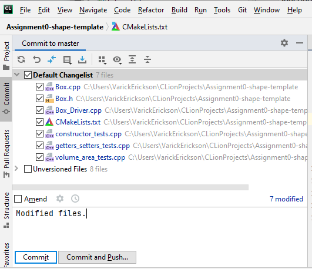

All of the files are being committed with the very generic comment "Modified 
files".  This does not offer much information about this "save state".  You 
would have to look at the "diff" in order to figure out what was actually 
changed.

Remember, in industry you will be likely working with a group of programmers 
and you need to clearly communicate what changes are made.  Develop good 
habits now and you can talk about it during interviews!

## Unversioned Files

When you are committing, you may notice that there is a collection of 
"Unversioned Files".

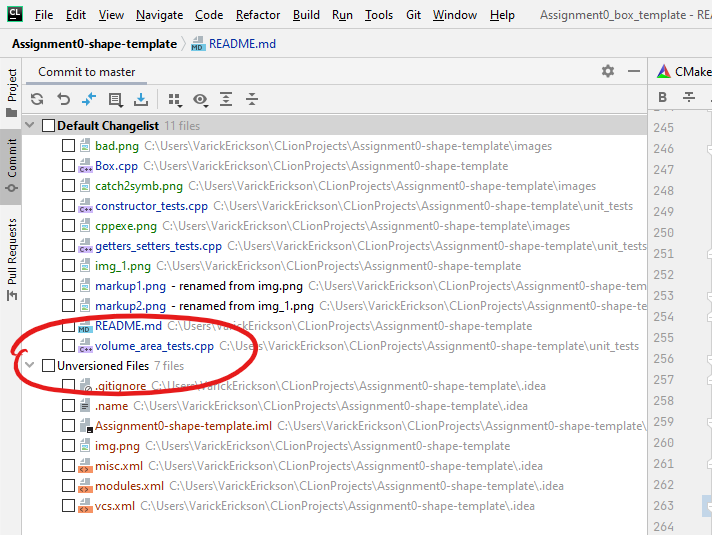

These are files in the project that are not currently part of the Git 
repository.  You will typically see quite a few of these as CLion will 
generate a number of files when building the projects.

***DO NOT COMMIT THESE UNVERSIONED FILES***

Simply leave the box unchecked when committing and pushing. If there is a 
file you DO want to add to the project, then you can select that individual 
file.  We will mention any instances where you will need to commit new files 
to your repository.

# Submitting your Assignment
To "submit" your assignment, you simply Commit and Push your project before 
the deadline.  We will grade the version pushed to the repository.  Be sure 
to commit and push ***ALL*** the source files changed. And remember,

***DO NOT COMMIT/PUSH UNVERSIONED FILES***

# Checking your Points

Each time you push the assignment, the assignment will be automatically graded.
You can check your points on github by checking the main page:

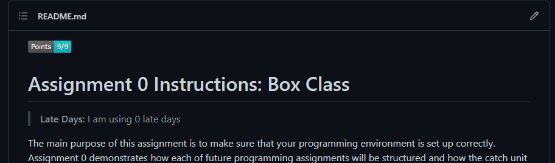

Note, that it can take several minutes for the points to update after you 
push the assignment.